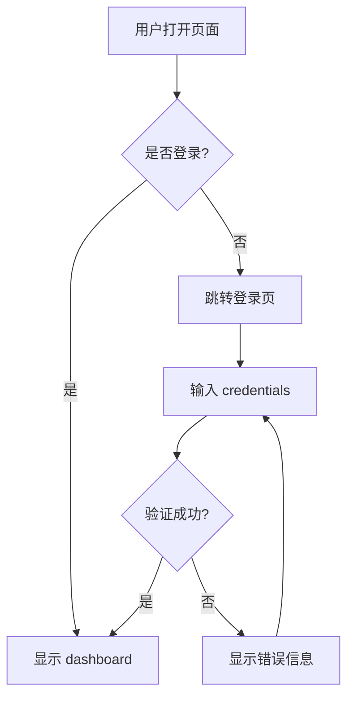

# 01-requirement-analyst - 需求分析师

> **版本**: 1.0.0
> **技能类型**: Core Skill
> **所属项目**: 产品经理AI助理

---

## 🎯 功能定位

将模糊的业务语言转化为结构化的需求规格，解决"业务方说不清需求"的痛点。

---

## 🩺 触发条件 (Symptoms & Triggers)

当以下场景出现时，激活此技能：

- [ ] 收到业务方的口头/文字需求描述
- [ ] PRD 文档缺少清晰的用户故事
- [ ] 需求评审时发现逻辑断层
- [ ] 开发阶段频繁出现"需求变更"
- [ ] 用户说"我要一个像XXX那样的功能"

---

## 🛠️ 7步工作流 (7-Step Workflow)

### Step 1: 需求捕获 (Capture)
**目标**: 完整记录原始需求，不遗漏任何信息

**输入**: 业务方提供的任何格式需求（文字/语音/截图）
**输出**: `raw-requirements.md`

**检查清单**:
- [ ] 记录需求提出者身份
- [ ] 记录需求背景/场景
- [ ] 记录期望结果
- [ ] 记录时间约束
- [ ] 记录相关利益方

---

### Step 2: 利益相关者识别 (Stakeholders)
**目标**: 明确谁会使用这个功能，谁会被影响

**输出**: `stakeholders.md`

**模板**:
```markdown
## 主要用户 (Primary Users)
- 角色: ___
- 目标: ___
- 痛点: ___

## 次要用户 (Secondary Users)
- 角色: ___
- 使用频率: ___

## 业务方 (Business Stakeholders)
- 决策者: ___
- 影响者: ___
```

---

### Step 3: 用户故事提取 (User Stories)
**目标**: 将需求转化为标准用户故事格式

**输出**: `user-stories.md`

**格式规范**:
```markdown
## US-001: [故事标题]
**作为** [角色]
**我希望** [功能]
**以便** [价值]

**验收标准** (Acceptance Criteria):
- [ ] AC1: 给定...当...那么...
- [ ] AC2: 给定...当...那么...
- [ ] AC3: 给定...当...那么...

**优先级**: MoSCoW (Must/Should/Could/Won't)
**估算**: [故事点]
```

---

### Step 4: 功能拆解 (Functional Decomposition)
**目标**: 将大需求拆分为可交付的功能点

**输出**: `feature-breakdown.md`

**结构**:
```markdown
## 功能模块: [模块名]

### 核心功能
1. [功能点1]
   - 输入: ___
   - 处理: ___
   - 输出: ___

### 边界情况
- [异常情况1]: 处理方案
- [异常情况2]: 处理方案

### 非功能需求
- 性能: ___
- 安全: ___
- 兼容性: ___
```

---

### Step 5: 流程图绘制 (Flow Mapping)
**目标**: 可视化用户操作流程

**输出**: `user-flows.md` (Mermaid 格式)

**示例**:
```markdown

```

---

### Step 6: 数据模型识别 (Data Model)
**目标**: 识别涉及的核心实体和关系

**输出**: `data-model.md`

**模板**:
```markdown
## 实体: [实体名]

**属性**:
- id: UUID (PK)
- name: String (required)
- status: Enum [active, inactive]
- created_at: DateTime

**关系**:
- belongs_to: [其他实体]
- has_many: [其他实体]

**约束**:
- name 唯一
- status 默认 active
```

---

### Step 7: 需求确认 (Validation)
**目标**: 与业务方确认结构化需求是否准确

**输出**: `requirements-v1.md` (合并以上所有内容)

**确认清单**:
- [ ] 用户故事得到业务方认可
- [ ] 验收标准可测试
- [ ] 边界情况已覆盖
- [ ] 优先级达成一致
- [ ] 时间估算被接受

---

## ✅ 行动检查点 (Action Checklist)

### 物理级合规检查

- [ ] **文件命名**: 所有输出文件使用 kebab-case
- [ ] **版本标记**: 文件名包含版本号 (v1, v2...)
- [ ] **位置正确**: 所有文件存入 `docs/requirements/` 目录
- [ ] **索引更新**: 在 `docs/INDEX.md` 中登记新文档
- [ ] **Git 提交**: 完成后立即提交，message: "需求分析: [模块名]"

---

## 🧠 理性化表格 (Rationalization Table)

| 常见陷阱 | 对抗策略 | 检查方式 |
|---------|---------|---------|
| **过度工程** | 坚持MVP原则，先解决核心痛点 | 每个功能问:"没有它用户能工作吗?" |
| **遗漏边界** | 强制列出至少3个异常场景 | 检查清单必须勾选 |
| **模糊验收** | 验收标准必须可测试/可验证 | 用 Given-When-Then 格式 |
| **忽视非功能** | 每个需求必须标注性能/安全要求 | 检查 data-model 中的约束 |
| **闭门造车** | Step 7 必须得到业务方确认 | 需要书面确认或邮件回复 |

---

## 📋 使用示例

### 示例 1: 电商购物车需求

**原始需求**: "用户可以把商品加入购物车，然后结算"

**执行流程**:
1. **Capture**: 记录用户场景、商品类型、结算方式
2. **Stakeholders**: 识别买家、卖家、平台运营
3. **User Stories**: 
   - US-001: 作为买家，我希望添加商品到购物车，以便稍后统一结算
   - US-002: 作为买家，我希望修改购物车商品数量，以便调整购买量
4. **Feature Breakdown**: 添加商品、修改数量、删除商品、结算流程
5. **User Flow**: 商品页 → 购物车 → 结算页 → 支付 → 订单确认
6. **Data Model**: Cart, CartItem, Product, Order 实体
7. **Validation**: 与业务方确认购物车是否支持跨店铺

---

## 🔗 关联技能

- **下游**: `02-document-writer` - 将结构化需求转化为标准PRD
- **下游**: `03-audit-expert` - 审计需求的完整性和逻辑性
- **上游**: 无（此技能为工作流起点）

---

## 📝 版本历史

| 版本 | 日期 | 变更 |
|------|------|------|
| 1.0.0 | 2026-03-14 | 初始版本，基于 Skills 2.0 规范 |

---

*技能创建*: 产品经理AI助理项目
*规范遵循*: Skills 2.0 Framework
