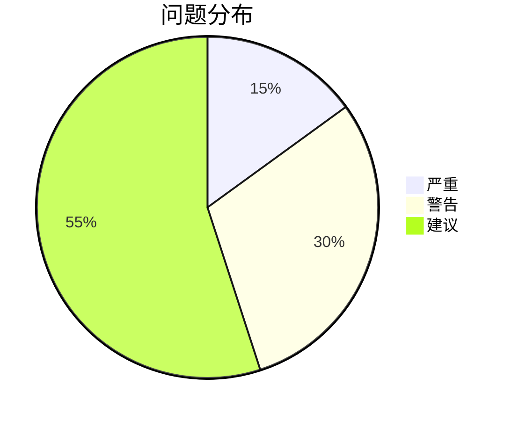

# 04-report-generator - 报告生成器

> **版本**: 1.0.0
> **技能类型**: Core Skill
> **所属项目**: 产品经理AI助理

---

## 🎯 功能定位

将审计结果、需求分析或项目状态转化为格式化的正式报告，支持多种输出格式和受众定制。

---

## 🩺 触发条件 (Symptoms & Triggers)

当以下场景出现时，激活此技能：

- [ ] 审计完成后需要输出正式审计报告
- [ ] 需要向管理层汇报项目状态
- [ ] 需要向开发团队输出技术规范
- [ ] 需要向业务方输出需求确认书
- [ ] 项目里程碑需要生成阶段性报告

---

## 🛠️ 7步工作流 (7-Step Workflow)

### Step 1: 输入识别与分类 (Input Classification)
**目标**: 识别输入数据类型并选择报告模板

**支持的输入类型**:

| 输入类型 | 来源文件 | 报告用途 |
|---------|---------|---------|
| **审计结果** | `audit-report-*.md` | 质量评估报告 |
| **需求分析** | `01-requirement-analyst/` 输出 | 需求规格确认 |
| **PRD 文档** | `docs/prd/PRD-*.md` | 产品规格书 |
| **项目状态** | `state/context.md` | 项目进度报告 |
| **工作日志** | `state/work-log.md` | 工作量统计 |

**报告类型选择**:

| 报告类型 | 目标受众 | 格式特点 |
|---------|---------|---------|
| **执行摘要** | 高管/决策者 | 1页，关键结论+建议 |
| **详细报告** | 产品经理/团队 | 完整分析，含数据支撑 |
| **技术报告** | 开发团队 | 技术细节，实现指导 |
| **审计报告** | QA/评审方 | 问题清单，修复跟踪 |
| **演示文稿** | 会议汇报 | PPT格式，可视化 |

---

### Step 2: 受众分析 (Audience Analysis)
**目标**: 根据受众调整报告内容和风格

**受众画像模板**:

```markdown
## 受众: [角色]
- **技术背景**: 高/中/低
- **业务熟悉度**: 高/中/低
- **关注重点**: 进度/质量/风险/成本
- **时间约束**: 详细/摘要
- **决策权限**: 决策/建议/知情
```

**内容适配规则**:

| 受众 | 语言风格 | 技术深度 | 重点内容 |
|------|---------|---------|---------|
| **高管** | 简洁，结论先行 | 低 | ROI, 风险, 里程碑 |
| **产品经理** | 专业，结构化 | 中 | 需求完整性，用户体验 |
| **开发团队** | 精确，可执行 | 高 | 技术细节，接口定义 |
| **业务方** | 通俗，场景化 | 低 | 业务价值，操作流程 |
| **QA团队** | 严谨，可验证 | 中 | 测试点，验收标准 |

---

### Step 3: 内容提取与重组 (Content Extraction)
**目标**: 从输入文件中提取关键信息并重组

**提取规则**:

#### 从审计报告提取
```markdown
输入: audit-report-xxx.md
提取:
- 总体评级 → 报告摘要
- 问题统计 → 可视化图表
- 严重问题 → 重点突出
- 修复清单 → 行动项
```

#### 从PRD提取
```markdown
输入: PRD-xxx.md
提取:
- 文档信息 → 报告元数据
- 背景目标 → 执行摘要
- 用户故事 → 功能清单
- 功能规格 → 详细章节
```

#### 从状态文件提取
```markdown
输入: state/context.md
提取:
- 当前状态 → 进度指示
- 历史记录 → 趋势分析
- 待办事项 → 后续计划
```

---

### Step 4: 报告结构设计 (Structure Design)
**目标**: 设计清晰的报告结构

**标准报告结构**:

```markdown
# [报告标题]

## 1. 执行摘要 (Executive Summary)
- 核心结论（1-2句话）
- 关键数据（3-5个指标）
- 主要建议（3条以内）

## 2. 背景与目标 (Background)
- 项目/任务背景
- 报告目的
- 范围界定

## 3. 方法与过程 (Methodology)
- 数据来源
- 分析方法
- 评估标准

## 4. 发现与结果 (Findings)
### 4.1 [主题1]
### 4.2 [主题2]
...

## 5. 风险与建议 (Recommendations)
| 优先级 | 建议 | 预期效果 | 负责人 |
|--------|------|---------|--------|
| P0 | ... | ... | ... |

## 6. 附录 (Appendix)
- 详细数据
- 原始文档链接
- 术语表
```

---

### Step 5: 可视化增强 (Visualization)
**目标**: 使用图表提升报告可读性

**推荐图表类型**:

| 数据类型 | 图表 | 用途 |
|---------|------|------|
| 比例分布 | 饼图/环形图 | 问题分级统计 |
| 趋势变化 | 折线图 | 进度趋势 |
| 对比分析 | 柱状图 | 多维度对比 |
| 流程关系 | 流程图 | 工作流程 |
| 状态分布 | 甘特图 | 项目进度 |
| 矩阵分析 | 四象限图 | 风险-影响矩阵 |

**Mermaid 示例**:
```markdown



```

---

### Step 6: 多格式输出 (Multi-Format Output)
**目标**: 生成多种格式的报告文件

**输出格式**:

| 格式 | 扩展名 | 适用场景 | 生成方式 |
|------|--------|---------|---------|
| **Markdown** | .md | 版本控制，协作编辑 | 原生 |
| **Word** | .docx | 正式文档，可编辑 | pandoc |
| **PDF** | .pdf | 正式归档，不可篡改 | pandoc |
| **HTML** | .html | 在线浏览，交互式 | pandoc |
| **PowerPoint** | .pptx | 会议演示 | python-pptx |

**生成命令**:
```bash
# Markdown → Word
pandoc report.md -o report.docx --reference-doc=templates/report-template.docx

# Markdown → PDF
pandoc report.md -o report.pdf --pdf-engine=xelatex -V CJKmainfont="SimSun"

# Markdown → HTML
pandoc report.md -o report.html --template=templates/report-template.html

# Markdown → PPT (自定义脚本)
python scripts/md-to-pptx.py report.md -o report.pptx
```

---

### Step 7: 交付与归档 (Delivery & Archive)
**目标**: 交付报告并记录元数据

**交付清单**:
- [ ] 主报告（PDF格式，正式版本）
- [ ] 可编辑版本（Word/Markdown）
- [ ] 演示版本（PPT，如需要）
- [ ] 邮件正文（执行摘要）

**归档信息**:
```markdown
## 报告元数据
- **报告ID**: RPT-[项目]-[日期]-[序号]
- **标题**: [标题]
- **类型**: [类型]
- **受众**: [受众]
- **生成日期**: YYYY-MM-DD
- **版本**: v1.0
- **输入文件**: [源文件路径]
- **生成人**: AI Assistant
- **审核人**: [待填写]
- **状态**: 草稿/已审核/已发布
```

---

## ✅ 行动检查点 (Action Checklist)

### 物理级合规检查

- [ ] **文件命名**: `RPT-[项目]-[日期]-[类型]-v[X].[扩展名]`
- [ ] **位置正确**: 
  - Markdown: `docs/reports/`
  - PDF: `docs/reports/pdf/`
  - Word: `docs/reports/word/`
  - PPT: `docs/reports/ppt/`
- [ ] **索引更新**: 在 `docs/reports/INDEX.md` 登记
- [ ] **元数据完整**: 报告头部包含完整元数据
- [ ] **Git 提交**: message: "报告: [标题] v[X]"

---

## 🧠 理性化表格 (Rationalization Table)

| 常见陷阱 | 对抗策略 | 检查方式 |
|---------|---------|---------|
| **信息过载** | 执行摘要限制在1页，详情放附录 | 页数检查 |
| **受众错配** | 强制受众分析，不跳过 | 检查受众画像 |
| **格式混乱** | 使用模板，自动化生成 | 模板符合度检查 |
| **数据过时** | 报告标注生成时间，定期更新 | 时间戳检查 |
| **缺乏行动项** | 必须包含可执行的Recommendations | 检查建议表格 |

---

## 📋 使用示例

### 示例: 生成审计报告

**输入**: `audit-report-prd-login-v1.md`

**受众**: 产品经理 + 开发团队

**输出结构**:

```markdown
# PRD 审计报告 - 登录功能

## 1. 执行摘要
**总体评级**: C (需改进)

**关键发现**:
- 2个严重问题需立即修复
- 1个警告问题建议优化
- 预计修复时间: 2人日

**核心建议**:
1. 补充验证码重发机制
2. 明确并发登录策略
3. 添加性能指标定义

## 2. 问题详情
...

## 5. 修复计划
| 优先级 | 问题 | 负责人 | 截止日期 |
|--------|------|--------|---------|
| P0 | 验证码重发 | 产品经理 | 2026-03-16 |
| P0 | 并发登录 | 架构师 | 2026-03-16 |
| P1 | 性能指标 | 产品经理 | 2026-03-18 |
```

**输出文件**:
- `RPT-prd-login-20260314-audit-v1.pdf` (正式)
- `RPT-prd-login-20260314-audit-v1.docx` (可编辑)
- `RPT-prd-login-20260314-audit-v1.pptx` (演示)

---

## 🔗 关联技能

- **上游**: `03-audit-expert` - 提供审计结果
- **上游**: `02-document-writer` - 提供 PRD 文档
- **上游**: `01-requirement-analyst` - 提供需求分析结果
- **辅助**: `docx`, `pptx`, `pdf` - 文档格式转换技能

---

## 📝 版本历史

| 版本 | 日期 | 变更 |
|------|------|------|
| 1.0.0 | 2026-03-14 | 初始版本，基于 Skills 2.0 规范 |

---

*技能创建*: 产品经理AI助理项目
*规范遵循*: Skills 2.0 Framework
