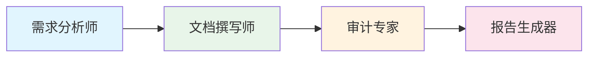

# 产品经理AI助理 (Product Manager AI Assistant)

> **版本**: 2.0.0
> **重构日期**: 2026-03-14
> **原项目**: PRD & Design Auditor

AI 驱动的产品经理工作流助手，覆盖需求分析 → 文档撰写 → 质量审计 → 报告生成的完整闭环。

---

## 🎯 核心能力



| 技能 | 功能 | 解决痛点 |
|------|------|---------|
| **01-requirement-analyst** | 将模糊需求转化为结构化用户故事 | 业务方"说不清需求" |
| **02-document-writer** | 生成标准化 PRD 文档 | 文档格式混乱、不完整 |
| **03-audit-expert** | 审计 PRD 的逻辑漏洞和质量缺陷 | 需求缺陷流入开发阶段 |
| **04-report-generator** | 输出多格式正式报告 | 沟通成本高、信息不同步 |

---

## 🚀 快速开始

### 工作流命令

```bash
# 分析需求
/analyze-requirement [需求描述]

# 生成 PRD
/write-prd [需求文件]

# 审计 PRD
/audit-prd [PRD文件]

# 生成报告
/generate-report [审计结果]

# 完整流程
/pm-workflow [需求描述]  # 一键执行全部4步
```

### 目录结构

```
prd-design-auditor/
├── .skills/                    # 核心技能库
│   ├── 01-requirement-analyst/ # 需求分析师
│   ├── 02-document-writer/     # 文档撰写师
│   ├── 03-audit-expert/        # 审计专家
│   ├── 04-report-generator/    # 报告生成器
│   └── [其他技能...]
├── core/                       # 协议文档
│   ├── identity.md             # AI身份与语言规范
│   ├── routing.md              # 任务路由
│   ├── architecture.md         # 架构法则
│   └── session-protocol.md     # 会话协议
├── docs/                       # 项目文档
│   ├── prd/                    # PRD文档
│   ├── audit/                  # 审计报告
│   └── reports/                # 正式报告
├── state/                      # 状态锚点
│   ├── context.md              # 当前状态 ⭐
│   └── work-log.md             # 工作日志
├── .claude/                    # Claude配置
│   └── product-strategy-context.md # 产品战略锚点
├── README.md                   # 本文件
├── TODO.md                     # 任务清单
└── PROJECTS.md                 # 项目索引
```

---

## 📋 使用示例

### 场景1: 新业务需求接入

```bash
# Step 1: 需求分析
# 输入: 业务方的口头需求
# 输出: 结构化的用户故事和功能规格
cat > raw-requirement.txt << 'EOF'
用户想要一个积分系统，可以赚积分、花积分，
还能看积分明细。积分可以兑换商品。
EOF

# AI 执行 01-requirement-analyst
# 生成: docs/requirements/user-stories.md
# 生成: docs/requirements/feature-breakdown.md
```

### 场景2: PRD文档生成

```bash
# Step 2: 文档撰写
# 输入: 需求分析输出
# 输出: 标准化 PRD 文档

# AI 执行 02-document-writer
# 生成: docs/prd/PRD-points-system-v1.md
# 生成: docs/prd/PRD-points-system-v1.docx (Word)
# 生成: docs/prd/PRD-points-system-v1.pdf (PDF)
```

### 场景3: PRD质量审计

```bash
# Step 3: 质量审计
# 输入: PRD文档
# 输出: 审计报告

# AI 执行 03-audit-expert
# 生成: docs/audit/audit-report-prd-points-v1.md
# 评级: B (良好) / C (需改进) / D (不合格)
```

### 场景4: 报告生成

```bash
# Step 4: 报告输出
# 输入: 审计结果
# 输出: 多格式正式报告

# AI 执行 04-report-generator
# 生成: docs/reports/RPT-points-20260314-audit-v1.pdf
# 生成: docs/reports/RPT-points-20260314-audit-v1.pptx
```

---

## 🛠️ 技能详情

### 01-requirement-analyst (需求分析师)

**触发条件**:
- 收到业务方的原始需求
- PRD缺少清晰的用户故事
- 开发阶段频繁出现需求变更

**输出**:
- `raw-requirements.md` - 原始需求记录
- `user-stories.md` - 用户故事（含验收标准）
- `feature-breakdown.md` - 功能拆解
- `user-flows.md` - 用户流程图
- `data-model.md` - 数据模型

**文档**: [.skills/01-requirement-analyst/SKILL.md](.skills/01-requirement-analyst/SKILL.md)

---

### 02-document-writer (文档撰写师)

**触发条件**:
- 需求分析已完成
- 需要生成正式PRD供评审
- 现有PRD格式需要重构

**输出**:
- `PRD-[功能名]-v[X].md` - Markdown格式
- `PRD-[功能名]-v[X].docx` - Word格式
- `PRD-[功能名]-v[X].pdf` - PDF格式

**文档**: [.skills/02-document-writer/SKILL.md](.skills/02-document-writer/SKILL.md)

---

### 03-audit-expert (审计专家)

**触发条件**:
- PRD已完成，准备进入开发
- 收到供应商PRD需要评审
- 开发中出现"需求不明确"问题

**输出**:
- `audit-report-[PRD名]-v[X].md` - 审计报告
- 评级: A/B/C/D
- 问题清单（严重/警告/建议）

**审计维度**:
- 完整性审计
- 逻辑一致性审计
- 可行性审计
- 规则库审计

**文档**: [.skills/03-audit-expert/SKILL.md](.skills/03-audit-expert/SKILL.md)

---

### 04-report-generator (报告生成器)

**触发条件**:
- 审计完成需要输出正式报告
- 向管理层汇报项目状态
- 项目里程碑需要阶段性报告

**输出**:
- `RPT-[项目]-[日期]-[类型]-v[X].pdf` - 正式报告
- `RPT-[项目]-[日期]-[类型]-v[X].docx` - 可编辑版
- `RPT-[项目]-[日期]-[类型]-v[X].pptx` - 演示版

**文档**: [.skills/04-report-generator/SKILL.md](.skills/04-report-generator/SKILL.md)

---

## 📊 项目状态

查看当前状态: [state/context.md](state/context.md)

### 最近更新
- ✅ 重构为"产品经理AI助理"架构
- ✅ 创建4个核心技能（01-04）
- 🟡 待测试完整工作流
- 🟡 待收集真实业务需求样本

---

## 🔧 技术规范

- **框架**: AI Coding Standards v10.0
- **技能规范**: Skills 2.0
- **语言**: 中文优先
- **协议**: 遵循 `core/` 目录下的身份、路由、架构协议

---

## 📝 相关链接

- [产品战略锚点](.claude/product-strategy-context.md)
- [任务清单](TODO.md)
- [项目索引](PROJECTS.md)
- [AI Coding Standards](https://github.com/windripple82/ai-coding-standards)

---

**维护者**: AI Assistant
**最后更新**: 2026-03-14
