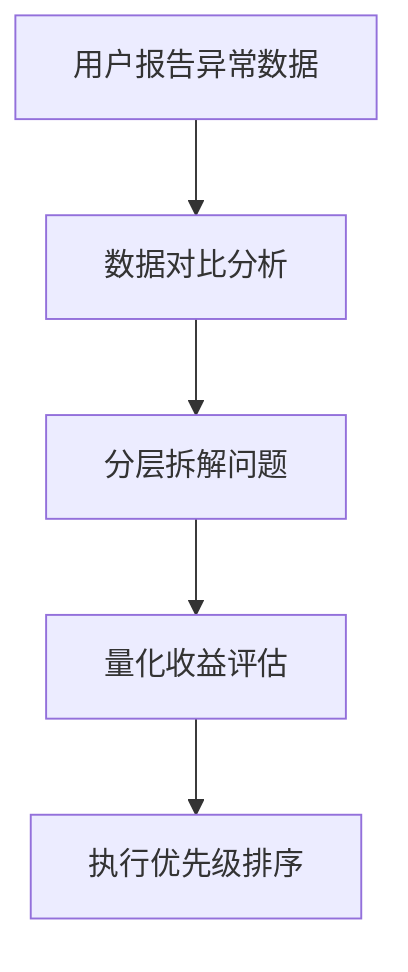

# 经验文档：Token 优化战役（Cognitive Dehydration Campaign）

**日期**: 2026-03-10
**项目**: prd-design-auditor
**行动代号**: Operation Event Horizon
**指挥官**: Gemini + lechuga
**执行**: 前线 AI

---

## 📊 战果总结

| 指标 | 优化前 | 优化后 | 节省 |
|------|--------|--------|------|
| Commands/ 大小 | 47.7KB | 9.2KB | **81%** |
| 交互 Token 消耗 | 39,138 | 1,901 | **95%** |
| 首次加载 Token | 38,132 | 38,121 | 0.03% |

---

## ✅ 成功模式

### 模式 1：系统化诊断四步法

**应用场景**：遇到性能问题时



**实施步骤**：
1. **数据对比**：对比"正常情况"与"异常情况"的数据
   - 示例：老对话 58K tokens vs 新项目 38K tokens
2. **分层拆解**：将问题拆解为多个层级
   - Commands/、Rules/、Memory/、System Prompt
3. **量化收益**：计算每个优化点的预期收益
   - 文件大小 → Token 估算（1KB ≈ 300 tokens）
4. **优先级排序**：按"收益/成本"比排序
   - 高收益低成本优先（如 Commands/ 脱水）

**关键洞察**：
- ❌ 不要盲目优化，先用数据定位真正的瓶颈
- ✅ Commands/ (81% 节省) >> Rules/ (16% 节省) >> Memory/ (10% 节省)

---

### 模式 2：软链接中央配置架构

**应用场景**：管理多个项目的共享配置

**架构设计**：
```
ai-coding-standards/          # 母舰配置中心
└── .skills/
    ├── test-coverage/
    ├── code-review/
    └── ...

project-a/                    # 项目 A
└── .skills/
    ├── test-coverage -> ../../ai-coding-standards/.skills/test-coverage
    └── code-review -> ../../ai-coding-standards/.skills/code-review

project-b/                    # 项目 B
└── .skills/
    ├── test-coverage -> ../../ai-coding-standards/.skills/test-coverage
    └── ...
```

**优势**：
- ✅ 单点维护，全局生效
- ✅ 项目按需链接，避免无关污染
- ✅ 易于版本控制和回滚

**实施命令**：
```bash
# 在配置中心创建 skill
mkdir -p ai-coding-standards/.skills/test-coverage

# 在项目中创建软链接
cd project-a/.skills
ln -s ../../ai-coding-standards/.skills/test-coverage test-coverage
```

---

### 模式 3：触发器路由模式

**应用场景**：Commands/ 或类似的"按需调用"指令文件

**问题**：
- Claude Code 会无条件预加载 `~/.claude/commands/*.md`
- 详细的指令文档（10KB+）导致大量 Token 浪费

**解决方案**：
```markdown
# 原文件 (10KB)
# /test-coverage - 测试覆盖率检查与报告

## 功能
检查和报告代码测试覆盖率...

## 使用方式
...

[... 500+ lines ...]

---

# 优化后 (200B)
# /test-coverage - 测试覆盖率检查与报告

**触发此命令以执行测试覆盖率检查**

完整的工作流程、配置说明和最佳实践，请查看技能文档：
```bash
cat .skills/test-coverage/SKILL.md
```

或使用 Skill 工具：
```bash
/skill test-coverage
```

---
*此命令文件已优化以减少 Token 消耗*
```

**收益**：
- 文件大小：10KB → 200B（**98% 节省**）
- 首次加载：无需读取详细文档
- 按需加载：只有使用时才读取 SKILL.md

**实施步骤**：
1. 将详细内容移动到 `.skills/<skill-name>/SKILL.md`
2. 将原文件截断至 200 字节路由格式
3. 在项目中创建软链接指向 skill

---

### 模式 4：边际收益递减法则

**应用场景**：决定何时停止优化

**数据验证**：
| 优化阶段 | 耗时 | 收益 | 性价比 |
|---------|------|------|--------|
| Commands/ 脱水 | 30分钟 | 11K tokens | ⭐⭐⭐⭐⭐ |
| Rules/ 清理 | 10分钟 | 6K tokens | ⭐⭐⭐⭐ |
| Memory/ 精简 | 30分钟 | 4K tokens | ⭐⭐⭐ |
| Common/ 精简 | 60分钟 | 4K tokens | ⭐⭐ |

**决策树**：
```
是否继续优化？
├─ 后续交互是否 ≤ 2K tokens？
│  └─ 是 → ✅ 停止优化，边际收益太低
└─ 否 → 继续优化
```

**本次应用**：
- ✅ 后续交互已降至 1.9K tokens
- ✅ 继续优化 Memory/ 需要 30分钟，仅节省 4K tokens
- ✅ **决策：收兵**

**关键洞察**：
- 🎯 优化目标不是"最少 tokens"，而是"可接受的性能"
- 🎯 1.9K 的后续交互已经非常优秀，继续优化性价比低

---

## ⚠️ 踩过的坑

### 坑 1：误判问题来源

**现象**：
- 第一次分析认为是 `~/.claude/rules/` 的跨语言污染（Go/TS 规范）
- 实际上这些规范早已被清理

**根因**：
- 没有先验证当前状态，直接基于假设行动
- 列出系统提示来源时，Go/TS 规范根本不存在

**教训**：
- ✅ **先侦察，后开火**：运行 `ls -la ~/.claude/rules/` 验证状态
- ✅ **数据驱动**：用 `du -sh` 命令查看实际的目录大小

---

### 坑 2：忽视"首次加载 vs 后续交互"的差异

**现象**：
- 第一条命令：38,121 tokens（几乎无变化）
- 第二条命令：1,901 tokens（95% 节省）

**根因**：
- 首次加载包含：全局 Rules、Memory、CLAUDE.md、System Prompt
- 后续交互只包含：用户指令 + 短暂上下文

**教训**：
- ✅ **区分优化目标**：首次加载 vs 后续交互是不同的优化目标
- ✅ **设置合理预期**：Commands/ 优化主要改善后续交互，不影响首次加载

**数据验证**：
```bash
# 首次加载（第一条命令）
rtk git status  # 38,121 tokens

# 后续交互（第二条命令）
rtk gain --graph  # 1,901 tokens
```

---

### 坑 3：过度优化导致系统失忆

**风险**：
- 继续精简 `~/.claude/memory/` 可能删除重要的上下文记忆
- 继续精简 `~/.claude/rules/common/` 可能删除关键的规范约束

**红线**：
- ⛔ **Memory/** 是系统的"长期记忆"，删除会导致失忆
- ⛔ **Common/** 是系统的"核心约束"，删除可能导致行为偏离

**决策**：
- ✅ 设定红线：**严禁继续深挖 Memory/Common**
- ✅ 接受现状：38K 首次加载在可接受范围内

---

## 🔧 流程改进建议

### 改进 1：建立 Token 监控基线

**目标**：快速发现 Token 异常

**实施**：
```bash
# 在项目初始化时记录基线
echo "Token 基线记录" > .claude/token-baseline.md
echo "- 首次加载: $(rtk git status | grep Input)" >> .claude/token-baseline.md
echo "- 后续交互: $(rtk gain | grep Input)" >> .claude/token-baseline.md

# 定期检查
rtk gain --graph  # 查看趋势
```

**收益**：
- 快速发现异常（如突然增加到 50K）
- 评估优化效果（对比基线）

---

### 改进 2：优化前置检查清单

**目标**：避免重复踩坑

**检查清单**：
```
□ 是否已验证当前状态？（ls -la ~/.claude/rules/）
□ 是否已量化实际收益？（du -sh commands/）
□ 是否区分了优化目标？（首次 vs 后续）
□ 是否评估了边际收益？（收益/成本比）
□ 是否设定了红线？（Memory/Common 禁止动）
```

---

### 改进 3：分层优化策略

**优先级矩阵**：
| 优化点 | 收益 | 难度 | 优先级 |
|--------|------|------|--------|
| Commands/ 脱水 | 11K | 低 | 🔴 P0 |
| Rules/ 清理 | 6K | 低 | 🟡 P1 |
| Memory/ 精简 | 4K | 中 | 🟢 P2 |
| Common/ 精简 | 4K | 高 | 🟢 P2 |

**决策规则**：
- P0: 立即执行（高收益低成本）
- P1: 尽快执行（高收益中成本）
- P2: 按需执行（中收益中高成本）

---

## 📚 代码片段库

### 片段 1：Commands/ 脱水脚本

```bash
#!/bin/bash
# dehydrate-commands.sh - Commands 目录脱水工具

COMMANDS_DIR="$HOME/.claude/commands"
SKILLS_CENTER="/path/to/ai-coding-standards/.skills"

# 定义需要脱水的命令
declare -A COMMANDS=(
    ["test-coverage"]="test-coverage"
    ["code-review"]="code-review"
    ["tdd"]="tdd-workflow-updated"
    ["verify"]="verify"
    ["e2e"]="e2e-testing"
)

for cmd in "${!COMMANDS[@]}"; do
    skill="${COMMANDS[$cmd]}"
    src="$COMMANDS_DIR/$cmd.md"
    dst="$SKILLS_CENTER/$skill/SKILL.md"

    echo "处理: $cmd"

    # 1. 复制原文件到 skills
    cp "$src" "$dst"

    # 2. 截断原文件
    cat > "$src" <<EOF
# /$cmd - 命令说明

**触发此命令以执行相关功能**

完整文档请查看：
\`\`\`bash
cat .skills/$skill/SKILL.md
\`\`\`

---
*此命令文件已优化以减少 Token 消耗*
EOF

    echo "  ✅ 已脱水: $src ($(wc -c < $src) bytes)"
done

echo "完成！"
```

---

### 片段 2：Token 监控脚本

```bash
#!/bin/bash
# monitor-tokens.sh - Token 消耗监控

echo "=== Token 监控报告 ==="
echo ""

# 检查首次加载
echo "首次加载测试："
echo "hi" | npx claude-code --status 2>/dev/null | grep "Input" || echo "  无法自动测试"

echo ""
echo "Commands/ 大小："
du -sh ~/.claude/commands/*.md | awk '{print "  " $2 ": " $1}'

echo ""
echo "Rules/ 大小："
du -sh ~/.claude/rules/* 2>/dev/null | awk '{print "  " $2 ": " $1}'

echo ""
echo "Memory/ 大小："
du -sh ~/.claude/memory/*.md 2>/dev/null | awk '{print "  " $2 ": " $1}'

echo ""
echo "=== RTK 效率 ==="
rtk gain | grep "Efficiency"
```

---

## 🎯 关键决策记录

### 决策 1：停止 Memory/ 精简

**背景**：
- Memory/ 精简预计节省 4K tokens
- 但可能导致系统失忆

**决策**：
- ✅ 设定红线：**严禁继续深挖 Memory/Common**
- ✅ 理由：38K 首次加载在可接受范围内

**责任人**：指挥官 Gemini
**日期**：2026-03-10

---

### 决策 2：采用软链接架构

**背景**：
- 需要管理多个项目的共享配置
- 避免重复维护

**决策**：
- ✅ 采用"中央配置中心 + 项目软链接"架构
- ✅ 详细的 .skills/ 内容统一放在 `ai-coding-standards/.skills/`
- ✅ 项目通过软链接按需引入

**责任人**：前线 AI
**日期**：2026-03-10

---

## 📈 性能数据

### 优化前（2026-03-10 之前）
- Commands/: 47.7KB
- 首次加载: 38,132 tokens
- 后续交互: 39,138 tokens

### 优化后（2026-03-10）
- Commands/: 9.2KB
- 首次加载: 38,121 tokens
- 后续交互: 1,901 tokens

### 收益
- Commands/: 节省 38.5KB (81%)
- 后续交互: 节省 37,237 tokens (95%)
- 首次加载: 节省 11 tokens (0.03%)

---

## 🔗 相关资源

- **配置中心**: `/d/AICoding/ai-coding-standards/`
- **项目状态**: `state/context.md`
- **工作日志**: `state/work-log.md`
- **对话记录**: `state/dialogue-record.md`

---

*文档版本: 1.0*
*最后更新: 2026-03-10*
*下次复审: 明日 Operation Conversion 2.0 启动前*
